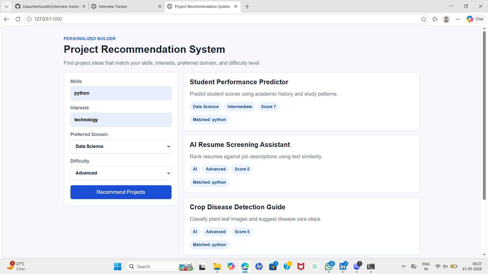

# Project Recommendation System

A Django-based recommendation system that suggests project ideas based on a user's skills, interests, preferred domain, and difficulty level.

## Overview

This project helps students and beginners choose suitable project ideas. Users enter their skills, interests, domain preference, and difficulty level. The system applies rule-based filtering and scoring logic to show personalized recommendations.

## Features

- Collects user skills, interests, preferred domain, and difficulty level
- Uses rule-based filtering and scoring logic
- Displays personalized project recommendations
- Shows matched skills and interests for each suggestion
- Provides a Django JSON API for recommendations
- Includes an interactive HTML, CSS, and JavaScript frontend

## Tech Stack

- Python
- Django
- HTML
- CSS
- JavaScript

## Project Structure

```text
project-recommendation-system/
  manage.py
  requirements.txt
  recommender.py
  project_recommender/
  recommendations/
  templates/
  static/
```

## Run Locally

```powershell
cd "C:\Users\Srinu\Documents\New project\project-recommendation-system"
pip install -r requirements.txt
python manage.py runserver 5002
```

Open:

```text
http://127.0.0.1:5002
```
## Screenshots

### Input Form


### Recommendation Results


### Full Page View




## Resume Summary

Developed a Django-based project recommendation system that suggests project ideas using rule-based filtering based on user skills, interests, domain preference, and difficulty level.

## Deployment

This project includes Render deployment files:

- `build.sh`
- `Procfile`
- `render.yaml`

Render settings:

```text
Build Command: bash build.sh
Start Command: gunicorn project_recommender.wsgi:application
```

Environment variables:

```text
DJANGO_DEBUG=false
DJANGO_SECRET_KEY=generate a secure value
DJANGO_ALLOWED_HOSTS=hemavathi-project-recommendation-system.onrender.com,.onrender.com,localhost,127.0.0.1
```
